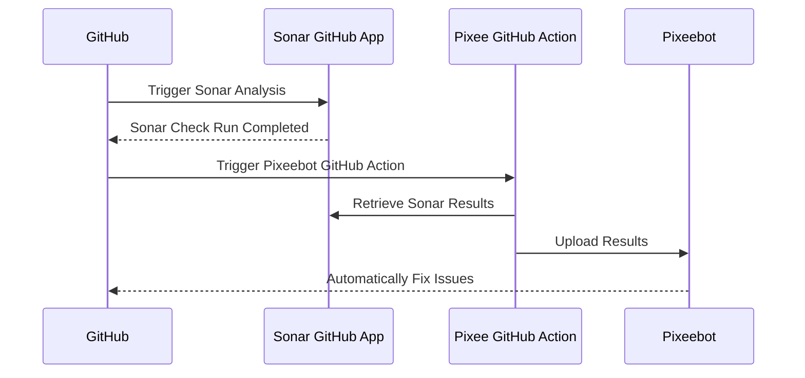

# Pixeebot Code Scanning Tool Integration

GitHub Action for upload code scanning results to [Pixeebot](https://pixee.ai/)
so it can fix the issues they found.

## For SonarCloud Users

For SonarCloud integration, the `pixee/upload-tool-results-action` must be
configured to execute only after the SonarCloud GitHub App completes a check.
The `sonar-pixeebot.yml` example workflow includes the requisite configuration
and is generic enough to apply to most repositories without modification.

1. Copy the
   [example sonarcloud-pixeebot.yml](./examples/sonarcloud-pixeebot.yml)
   workflow to the repository's `.github/workflows` directory.
1. Set the `SONAR_TOKEN` secret. Create a SonarCloud token at
   [https://sonarcloud.io/account/security](https://sonarcloud.io/account/security).
   See
   [Using secrets in GitHub Actions](https://docs.github.com/en/actions/security-guides/using-secrets-in-github-actions).

## For SonarQube Users

For SonarQube integration, the `pixee/upload-tool-results-action` must be
configured to execute after SonarQube has completed its analysis. In a typical
GitHub Action workflow that includes SonarQube, the step that performs the
SonarQube analysis will be followed by a step that applies the SonarQube Quality
Gate. The `pixee/upload-tool-results-action` should follow the SonarQube Quality
Gate. The workflow should be configured to run the
`pixee/upload-tool-results-action` step regardless of the outcome of the quality
gate, so that Pixeebot may fix the issues preventing the quality gate from
passing.

The `pixee/upload-tool-results-action` requires a SonarQube _user token_ token
that is permitted to read Security Hotspots. Typically, the `SONAR_TOKEN` secret
in a GitHub Actions workflow is a _project analysis token_. A _project analysis
token_ does not have the requisite permissions to read security hotspots. You
should use a new secret `PIXEE_SONAR_TOKEN` for the _user token_, to avoid
confusing it for the typical _project analysis token_.

```yaml
- name: SonarQube Quality Gate Check
  uses: sonarsource/sonarqube-quality-gate-action@master
  env:
    SONAR_HOST_URL: ${{ vars.SONAR_HOST_URL }}
    SONAR_TOKEN: ${{ secrets.SONAR_TOKEN }}

- name: Upload SonarQube Results to Pixeebot
  uses: pixee/upload-tool-results-action@v2
  if: always() && steps.sonarqube-analysis.outcome == 'success'
  with:
    tool: sonar
    sonar-host-url: ${{ vars.SONAR_HOST_URL }}
    sonar-token: ${{ secrets.PIXEE_SONAR_TOKEN }}
    sonar-component-key: "<insert-my-sonar-project-key>"
```

<!-- prettier-ignore -->
> [!NOTE]
> SonarQube Community Edition lacks the features necessary for Pixee's PR
> experience.

### Complete Examples

The following are examples of complete workflows that send SonarQube results
from the default branch to Pixee for inclusion in Pixeebot's next _continuous
improvement campaign_ analysis.

- [Java (Maven)](./examples/sonarqube-pixeebot-maven.yml)
- [Python](./examples/sonarqube-python.yml)

<!-- prettier-ignore -->
> [!TIP]
> The continuous improvement campaign reguarly sends fixes for the project's
> default branch. To request that Pixeebot continuous improvement campaign send
> fixes to the default branch immediately, add a comment with the contents
> "@pixeebot next" to any PR or issue in the repository.

## For Other Tools

For other supported tools that do not automatically fetch results, the `file`
input can be used. In this case, it is assumed that the results file is checked
into the repository and the provided path is relative to the repository root.

```yaml
- uses: pixee/upload-tool-results-action@v2
  with:
    # Use any supported SARIF tool here
    tool: <[semgrep|checkmarx|...]>
    # Path to the checked-in SARIF file relative to the repository root
    file: <path/to/results.sarif>
```

For a complete example, see [sarif-pixeebot.yml](./examples/sarif-pixeebot.yml).

## Permissions

All workflows using this action must include the `id-token: write` permission.

```yaml
permissions:
  contents: read
  id-token: write
```

The action uses this permission to create a GitHub token to authenticate to the
Pixee API. The Pixee API verifies that the GitHub-signed token originated from
an authorized GitHub workflow.

## Inputs

Detailed description of the inputs exposed by the
`pixee/upload-tool-results-action`:

```yaml
- uses: pixee/upload-tool-results-action
  with:
    # The supported code scanning tool that produced the results being uploaded to Pixeebot.
    # Allowed values: 'sonar', 'codeql', 'semgrep', 'defectdojo', 'contrast', 'checkmarx', 'snyk', 'polaris'
    # Required
    tool:

    # Token for authenticating requests to Sonar.
    # Required, when tool is "sonar". Only required for private repository.
    sonar-token:

    # Key identifying the Sonar component to be analyzed. Only necessary if deviating from Sonar's established convention.
    # Default: `owner_repo`
    sonar-component-key:

    # SonarCloud or SonarQube host URL. Use this to switch from SonarCloud to SonarQube.
    # Default: https://sonarcloud.io
    sonar-host-url:

    # Token for authenticating requests to DefectDojo.
    defectdojo-token:

    # Key identifying the DefectDojo product (repository) to be analyzed.
    defectdojo-product-name:

    # Base URL of the DefectDojo API.
    defectdojo-api-url:

    # Base URL of the Contrast API.
    contrast-api-url:

    # Unique identifier for the organization in Contrast that needs to be analyzed.
    contrast-org-id:

    # Unique identifier for the specific application within Contrast.
    contrast-app-id:

    # Api key for authenticating requests to Contrast.
    contrast-api-key:

    # Token for authenticating requests to Contrast.
    contrast-token:

    # The base URL of the Pixee API
    # Default: https://api.pixee.ai
    pixee-api-url:

    # Path to the tool's results file to upload to Pixeebot.
    # This is required when using a `tool` that does not support automatically fetching results. Contrast, Sonar, and DefectDojo integrations support automatically fetching results. When this input is used with those tools, the given file will be uploaded _instead of_ automatically fetching results.
    # Note: for Sonar results, the tool must be `sonar_hotspots` or `sonar_issues` instead of `sonar` when using this input.
    file:
```

## How Does It Work?

The following diagram illustrates how the action orchestrates the results from
Sonar, to Pixeebot, and then back to GitHub.



The code scanning results will feed both Pixeebot's _continuous improvement_ and
_pull request hardening_ features.

- When the code quality tool finds issues on an open PR, Pixeebot opens another
  PR to fix those issues.
- When the code quality tool finds issues on a commit that has been merged to
  the default branch, Pixeebot considers those results in its next _continuous
  improvement_ PR.
