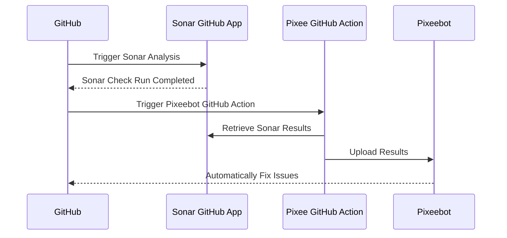

# Pixeebot Code Scanning Tool Integration

GitHub Action for upload code scanning results to [Pixeebot](https://pixee.ai/) so it can fix the issues they found.

## For Sonar Users

For Sonar integration, the `pixee/upload-tool-results-action` must be configured
to execute when the Sonar GitHub App completes a check. The `sonar-pixeebot.yml`
example workflow includes the requisite configuration and is generic enough to
apply to most repositories without modification.

1. Copy the [example sonar-pixeebot.yml](./examples/sonar-pixeebot.yml) workflow to the repository's `.github/workflows` directory.
1. Set the `SONAR_TOKEN` secret. Create a SonarCloud token at
   [https://sonarcloud.io/account/security](https://sonarcloud.io/account/security). See
   [Using secrets in GitHub Actions](https://docs.github.com/en/actions/security-guides/using-secrets-in-github-actions).

## Inputs

Detailed description of the inputs exposed by the `pixee/upload-tool-results-action`:

```yaml
- uses: pixee/upload-tool-results-action
  with:
    # The supported code scanning tool that produced the results being uploaded to Pixeebot.
    # Allowed values: 'sonar', 'codeql', 'semgrep'
    # Required
    tool:

    # Token for authenticating requests to SonarCloud.
    # Required, when tool is "sonar" and "file" has not been set. Only required for private repository.
    sonar-token:

    # Key identifying the SonarCloud component to be analyzed. Only necessary if deviating from SonarCloud's established convention.
    # Default: `owner_repo`
    sonar-component-key:

    # Base URL of the Sonar API. Use this to switch from SonarCloud to SonarQube.
    # Default: https://sonarcloud.io/api
    sonar-api-url:

    # Token for authenticating requests to DefectDojo.
    defectdojo-token:

    # Key identifying the DefectDojo product (repository) to be analyzed. 
    defectdojo-product-name:

    # Base URL of the DefectDojo API.
    defectdojo-api-url:

    # Path to the tool's results file to upload to Pixeebot. This does not apply to SonarCloud integration, because the action retrieves the results directly from SonarCloud.
    # Required, when `tool` is not "sonar"
    file:
```

## How Does It Work?

The following diagram illustrates how the action orchestrates the results from Sonar, to Pixeebot, and then back to GitHub.



The code scanning results will feed both Pixeebot's _continuous improvement_ and _pull request hardening_ features.

- When the code quality tool finds issues on an open PR, Pixeebot opens another
  PR to fix those issues.
- When the code quality tool finds issues on a commit that has been merged to
  the default branch, Pixeebot considers those results in its next _continuous
  improvement_ PR.
