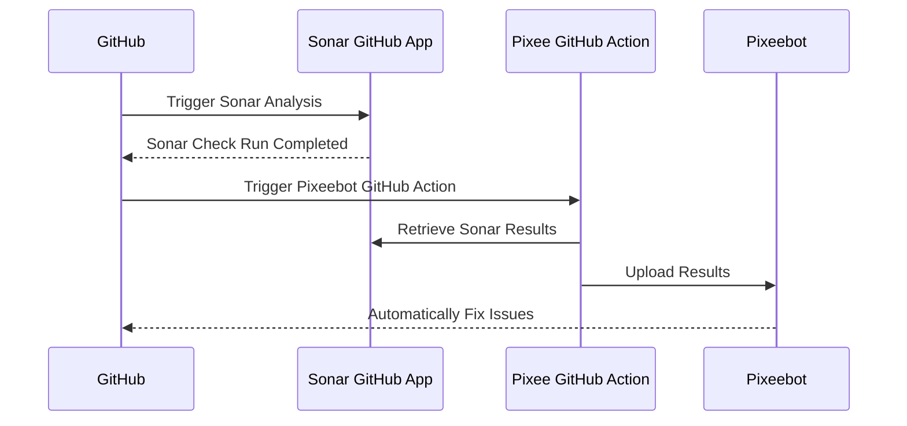

# Pixeebot Code Scanning Tool Integration

GitHub Action for extending [Pixeebot's](https://pixee.ai/) coverage to fix
issues found by supported code scanning tools.

Pixeebot automatically fixes issues detected by these tools when synced with the
results of those scans. Use this action to upload code scanning tool findings
with Pixeebot.



Works with both Pixeebot's _continuous improvement_ and _pull request hardening_
features.

- When the code quality tool finds issues on an open PR, Pixeebot opens another
  PR to fix those issues.
- When the code quality tool finds issues on a commit that has been merged to
  the default branch, Pixeebot considers those results in its next _continuous
  improvement_ PR.

## Sonar Usage

Note: this Action is only needed for private repositories. Pixeebot integrates
with public repositories using SonarCloud automatically.

1. Copy the [sonar-pixeeebot.yml](./examples/sonar-pixeebot.yml) workflow to the
   repository's `.github/workflows` directory.
1. Set the `SONAR_TOKEN` secret. See
   [Using secrets in GitHub Actions](https://docs.github.com/en/actions/security-guides/using-secrets-in-github-actions)

## Detailed Usage

```yaml
- uses: pixee/upload-tool-results-action
  with:
    # The supported code scanning tool that produced the results being uploaded to Pixeebot.
    # Allowed values: 'sonar', 'codeql', 'semgrep'
    # Required
    tool:

    # Token for authenticating requests to SonarCloud.
    # Required, when tool is "sonar" and "file" has not been set
    sonar-token:

    # Key identifying the SonarCloud component to be analyzed. Only necessary if deviating from SonarCloud's established convention.
    # Default: `owner_repo`
    sonar-component-key:

    # Base URL of the Sonar API. Use this to switch from SonarCloud to SonarQube.
    # Default: https://sonarcloud.io/api
    sonar-api-url:

    # Path to the tool's results file to upload to Pixeebot. This does not apply to SonarCloud integration, because the action retrieves the results directly from SonarCloud.
    # Required, when `tool` is not "sonar"
    file:
```
